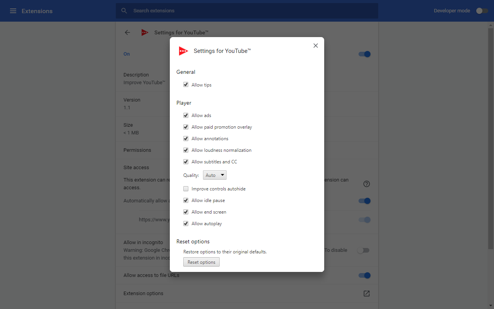

# Settings for YouTube™

Improve YouTube™

## Options

General

- Allow tips

Player

- Allow ads
- Allow paid promotion overlay
- Allow annotations
- Allow loudness normalization
- Allow subtitles and CC
- Quality: Auto, 144p, 240p, 360p, 480p, 720p, 1080p, 1440p, 2160p, 2880p, 4320p
- Improve controls autohide
- Allow idle pause
- Allow end screen
- Allow autoplay

Reset options

- Restore options to their original defaults.

YouTube is a trademark of Google Inc. Use of this trademark is subject to Google
Permissions.

## Screenshot

